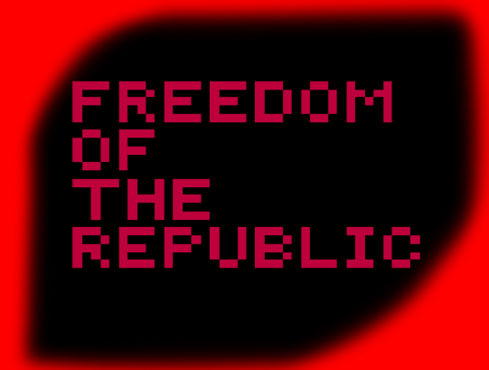
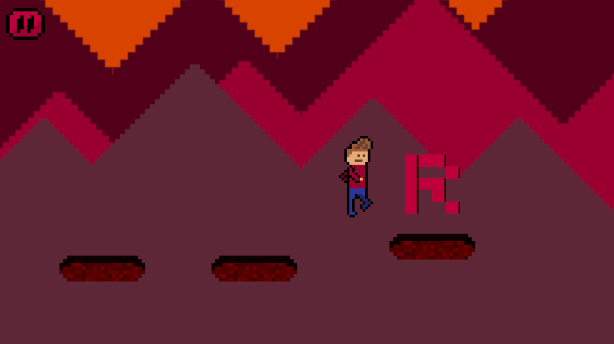
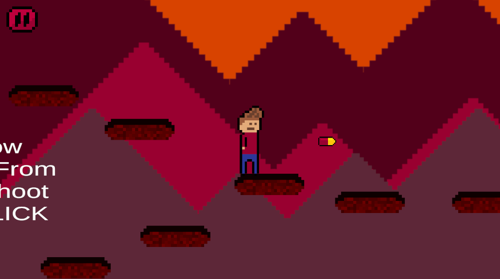
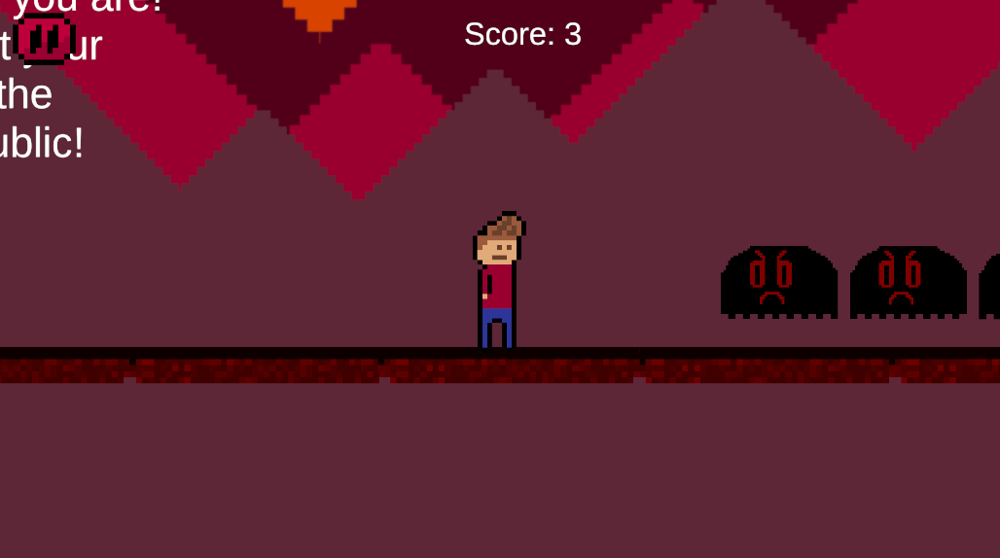

<div align="center">

# Freedom Of The Republic

### Retro-inspired 2D Pixel-Art Platformer

[](https://unity.com/)
[](https://learn.microsoft.com/en-us/dotnet/csharp/)
[](https://alexgdin.itch.io/freedom-of-the-republic)

### 🎮 [Play on itch.io](https://alexgdin.itch.io/freedom-of-the-republic)

</div>

---

## About The Game

**Freedom Of The Republic** is a 2D pixel-art platformer created for the **ROG Challenge 2024**.

The game focuses on exploration, movement, and score progression. Throughout the first levels, players collect letters that slowly reveal the path toward freedom.

To truly achieve the **Freedom Of The Republic**, players must improve their score and outperform their previous runs.

Built with a retro-inspired visual style and simple but challenging gameplay mechanics, the project was developed both as a game jam submission and as a learning experience in Unity game development.

---

## Features

- 🎮 Retro-style 2D platformer gameplay
- 🕹️ Smooth movement and jumping mechanics
- 🧩 Letter collection system
- 📈 Score-based progression
- 🎨 Pixel-art graphics
- ⚡ Built with Unity and C#

---

## Screenshots

> Rename screenshot files to avoid spaces for better compatibility.

### Gameplay






---

## Play The Game

🎮 itch.io Page:  
https://alexgdin.itch.io/freedom-of-the-republic

---

## Controls

| Key | Action |
|------|--------|
| A / D | Move |
| Space | Jump |
| Esc | Pause / Exit |

---

## Built With

- **Unity**
- **C#**
- **Pixilart** — artwork
- **Suno AI** — music

---

## Project Structure

```text
Assets/
Packages/
ProjectSettings/
```

---

## Installation

### Clone the repository

```bash
git clone https://github.com/alexgdin/Freedom-Of-The-Republic.git
```

### Open in Unity

1. Open Unity Hub
2. Click **Open Project**
3. Select the cloned repository folder

---

## Development Goals

This project was created to:

- Improve Unity development skills
- Learn better game architecture
- Practice pixel-art game design
- Participate in a game development challenge
- Gain experience publishing games online

---

## Future Improvements

- More levels
- Better enemy behavior
- Sound effects
- Improved UI
- Save system
- Controller support
- More animations

---

## Credits

### Development
- Alexandru DIN — Programming & Game Design

### Art
- Alexandru DIN

### Music
- Generated using Suno AI

---

## License

This project is published for educational and portfolio purposes.

---

<div align="center">

### Thanks for checking out the project!

⭐ If you enjoyed the project, consider starring the repository.

</div>
